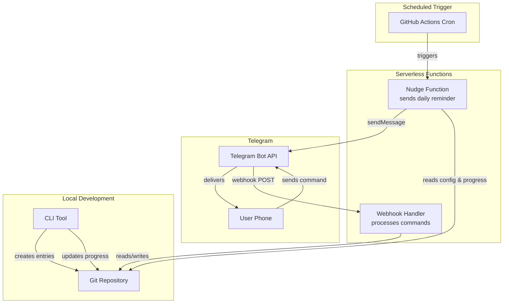

# Design Document: Daily Learning Nudge

## Overview

The Daily Learning Nudge system is a serverless personal learning habit tracker that combines a Telegram bot for notifications, a CLI tool for entry management, and Git-based storage for learning records and progress data. The system runs without any always-on infrastructure by leveraging GitHub Actions cron for scheduled notifications and Telegram webhooks (via a lightweight serverless function) for handling user commands.

**Key Design Decisions:**
- **Telegram webhook mode** over polling: Since there's no always-on server, webhook mode is required. A lightweight serverless endpoint (e.g., Vercel/Netlify function or GitHub Actions `repository_dispatch`) receives Telegram updates pushed by Telegram servers.
- **GitHub Actions cron** for scheduled nudges: Free, lives alongside the code, and requires no infrastructure. Cron drift (up to 15 minutes) is acceptable for a daily learning reminder.
- **Git-based flat-file storage**: All data (entries, progress, config) lives in the same repository as markdown and JSON files. No database needed.
- **Node.js runtime**: JavaScript backend aligns with the user's preference and works well for serverless functions and CLI tools.
- **`node-telegram-bot-api`**: Well-maintained, lightweight Telegram client library for Node.js, supporting both webhook and direct API calls.

## Architecture

The system consists of four primary subsystems connected through the Git repository as the shared data layer:



### Deployment Architecture

| Component | Runtime | Trigger |
|-----------|---------|---------|
| Nudge sender | GitHub Actions workflow | Cron schedule (configurable) |
| Webhook handler | Vercel/Netlify serverless function | Telegram webhook POST |
| CLI tool | Local Node.js | User invocation |
| Progress updater | Git hook (post-commit) or CLI subcommand | After entry commit |

### Data Flow

1. **Daily Nudge Flow**: GitHub Actions cron → runs nudge script → reads config/progress from repo → calls Telegram `sendMessage` API
2. **Command Flow**: User sends `/status` → Telegram POSTs to webhook URL → serverless function reads progress data → responds to Telegram
3. **Entry Creation Flow**: User runs CLI → scaffolds `learnings/YYYY/MM/DD.md` → user fills in → commits → post-commit hook updates progress JSON
4. **Streak Calculation Flow**: Progress updater recalculates streak on each commit, accounting for recovery days and quiet days

## Components and Interfaces

### 1. Nudge Sender (`src/nudge/sender.js`)

Responsible for composing and sending the daily reminder message via Telegram.

```javascript
/**
 * @param {Config} config - User configuration (chat ID, timezone, notification prefs)
 * @param {ProgressData} progress - Current progress state
 * @returns {Promise<SendResult>} - Delivery result with success/failure info
 */
async function sendDailyNudge(config, progress) {}

/**
 * @param {string} chatId - Telegram chat ID
 * @param {string} message - Message text
 * @param {number} retries - Remaining retry attempts (default 3)
 * @returns {Promise<SendResult>}
 */
async function sendWithRetry(chatId, message, retries = 3) {}

/**
 * @param {number} streakCount - Current streak
 * @param {boolean} completedToday - Whether today's entry is done
 * @returns {string} - Formatted message text
 */
function composeMessage(streakCount, completedToday) {}
```

### 2. Webhook Handler (`src/webhook/handler.js`)

Serverless function that receives Telegram updates and dispatches commands.

```javascript
/**
 * Serverless function entry point
 * @param {Request} req - HTTP request with Telegram update payload
 * @returns {Response} - HTTP response (200 OK to acknowledge)
 */
async function handleWebhook(req) {}

/**
 * Command router
 * @param {TelegramUpdate} update - Parsed Telegram update
 * @returns {Promise<string>} - Response message to send back
 */
async function routeCommand(update) {}
```

**Supported Commands:**
| Command | Handler | Description |
|---------|---------|-------------|
| `/start` | `handleStart()` | Register user, send welcome |
| `/status` | `handleStatus()` | Current streak + today's status |
| `/stats` | `handleStats()` | Full analytics summary |
| `/settime HH:MM` | `handleSetTime()` | Update notification time |
| `/settimezone TZ` | `handleSetTimezone()` | Update timezone |
| `/quietdays D1,D2` | `handleQuietDays()` | Set quiet days |
| (unrecognized) | `handleHelp()` | List available commands |

### 3. CLI Tool (`src/cli/index.js`)

Local command-line interface for scaffolding entries and checking progress.

```javascript
/**
 * Scaffold a new daily learning entry
 * @param {string} [date] - Optional date override (YYYY-MM-DD), defaults to today
 * @returns {string} - Path to created/existing file
 */
function scaffoldEntry(date) {}

/**
 * Validate a learning entry file
 * @param {string} filePath - Path to the markdown file
 * @returns {ValidationResult} - { valid: boolean, errors: string[] }
 */
function validateEntry(filePath) {}

/**
 * Display current progress summary to terminal
 */
function showProgress() {}
```

### 4. Folder Manager (`src/folders/manager.js`)

Handles directory creation and template generation.

```javascript
/**
 * Ensure directory structure exists for a given date
 * @param {string} baseDir - Root learnings directory
 * @param {Date} date - Target date
 * @returns {string} - Full path to the day's directory
 */
function ensureDirectoryStructure(baseDir, date) {}

/**
 * Generate a template markdown file for a learning entry
 * @param {Date} date - The learning day date
 * @returns {string} - Template content string
 */
function generateTemplate(date) {}

/**
 * Create or return existing entry file
 * @param {string} baseDir - Root learnings directory
 * @param {Date} date - Target date
 * @returns {{ path: string, created: boolean }}
 */
function createEntry(baseDir, date) {}
```

### 5. Progress Tracker (`src/progress/tracker.js`)

Calculates and persists streak and analytics data.

```javascript
/**
 * Record a completion for a given date
 * @param {ProgressData} data - Current progress state
 * @param {string} date - ISO date string (YYYY-MM-DD)
 * @param {string} timestamp - ISO 8601 completion timestamp
 * @returns {ProgressData} - Updated progress state
 */
function recordCompletion(data, date, timestamp) {}

/**
 * Calculate current streak accounting for recovery days and quiet days
 * @param {ProgressData} data - Progress state with completions
 * @param {Config} config - User config (quiet days, timezone, recovery enabled)
 * @param {string} today - Current date string (YYYY-MM-DD)
 * @returns {StreakInfo} - { current, longest, recoveryDaysRemaining }
 */
function calculateStreak(data, config, today) {}

/**
 * Calculate analytics for stats display
 * @param {ProgressData} data - Progress state
 * @param {Config} config - User config
 * @param {string} today - Current date
 * @returns {Analytics}
 */
function calculateAnalytics(data, config, today) {}

/**
 * Generate monthly progress report markdown
 * @param {ProgressData} data - Progress state
 * @param {number} year - Report year
 * @param {number} month - Report month (1-12)
 * @returns {string} - Markdown report content
 */
function generateMonthlyReport(data, year, month) {}
```

### 6. Config Manager (`src/config/manager.js`)

Handles reading/writing user configuration.

```javascript
/**
 * Load config from JSON file
 * @param {string} configPath - Path to config.json
 * @returns {Config}
 */
function loadConfig(configPath) {}

/**
 * Update a config field and persist
 * @param {string} configPath - Path to config.json
 * @param {Partial<Config>} updates - Fields to update
 * @returns {Config} - Updated config
 */
function updateConfig(configPath, updates) {}

/**
 * Validate a time string (HH:MM format)
 * @param {string} time - Time string to validate
 * @returns {boolean}
 */
function isValidTime(time) {}

/**
 * Validate an IANA timezone identifier
 * @param {string} tz - Timezone string
 * @returns {boolean}
 */
function isValidTimezone(tz) {}
```

## Data Models

### Config (`data/config.json`)

```json
{
  "telegramChatId": "123456789",
  "telegramBotToken": "BOT_TOKEN_HERE",
  "notificationTime": "09:00",
  "timezone": "America/New_York",
  "quietDays": ["saturday", "sunday"],
  "streakRecoveryEnabled": true,
  "notificationsEnabled": true,
  "webhookUrl": "https://your-app.vercel.app/api/webhook"
}
```

| Field | Type | Default | Description |
|-------|------|---------|-------------|
| `telegramChatId` | string | — | User's Telegram chat ID (set on `/start`) |
| `telegramBotToken` | string | — | Bot token from BotFather (stored as env var in production) |
| `notificationTime` | string | `"09:00"` | HH:MM format in user's timezone |
| `timezone` | string | `"UTC"` | IANA timezone identifier |
| `quietDays` | string[] | `[]` | Days of week (lowercase) when notifications are suppressed |
| `streakRecoveryEnabled` | boolean | `true` | Whether grace period is active |
| `notificationsEnabled` | boolean | `true` | Master toggle for notifications |
| `webhookUrl` | string | — | URL for Telegram webhook endpoint |

### Progress Data (`data/progress.json`)

```json
{
  "currentStreak": 12,
  "longestStreak": 45,
  "totalEntries": 87,
  "completions": {
    "2024-01-15": {
      "timestamp": "2024-01-15T18:30:00-05:00",
      "category": "rust",
      "timeSpent": 30
    }
  },
  "recoveryDays": {
    "2024-01-10": {
      "weekStart": "2024-01-08"
    }
  },
  "lastUpdated": "2024-01-15T18:30:00-05:00"
}
```

| Field | Type | Description |
|-------|------|-------------|
| `currentStreak` | number | Current consecutive days count |
| `longestStreak` | number | All-time best streak |
| `totalEntries` | number | Total completed learning entries |
| `completions` | object | Map of date → completion record |
| `completions[date].timestamp` | string | ISO 8601 completion time |
| `completions[date].category` | string | Category tag from entry |
| `completions[date].timeSpent` | number | Minutes spent (nullable) |
| `recoveryDays` | object | Map of date → recovery usage record |
| `recoveryDays[date].weekStart` | string | Monday of the week (for tracking weekly allowance) |
| `lastUpdated` | string | ISO 8601 timestamp of last progress update |

### Learning Entry Template (`learnings/YYYY/MM/DD.md`)

```markdown
---
date: 2024-01-15
topic: ""
category: ""
time_spent: 0
---

# Learning Entry: 2024-01-15

## Topic


## Summary


## Key Takeaways

- 

## Resources

- 
```

**Field Constraints:**
| Field | Required | Constraints |
|-------|----------|-------------|
| `date` | Yes | YYYY-MM-DD format, auto-filled |
| `topic` | Yes | 1–100 characters |
| `category` | Yes | Non-empty string (tag) |
| `time_spent` | No | Integer 1–480 (minutes) |
| Summary | No | Max 2000 characters |
| Key Takeaways | No | Max 10 items |
| Resources | No | Max 10 links |

### Motivational Messages (`data/messages.json`)

```json
{
  "reminders": [
    "🧠 Time to feed your brain! What will you learn today?",
    "📚 Your future self will thank you. Let's learn something new!",
    "🚀 Keep the momentum going! What's on the learning menu?",
    "💡 Small daily lessons compound into expertise. Ready?",
    "🌱 Growth happens one day at a time. What's today's lesson?"
  ],
  "congratulations": [
    "🎉 You did it! {streak} days and counting!",
    "🏆 Another day, another lesson! Streak: {streak}",
    "⭐ Consistent learner! Day {streak} complete!",
    "🔥 You're on fire! {streak}-day streak!",
    "✅ Done for today! {streak} days strong!"
  ]
}
```

### GitHub Actions Workflow (`.github/workflows/daily-nudge.yml`)

```yaml
name: Daily Learning Nudge
on:
  schedule:
    - cron: '0 9 * * *'  # Default 09:00 UTC, user adjusts in config
  workflow_dispatch: {}   # Manual trigger for testing

jobs:
  send-nudge:
    runs-on: ubuntu-latest
    steps:
      - uses: actions/checkout@v4
      - uses: actions/setup-node@v4
        with:
          node-version: '20'
      - run: npm ci
      - run: node src/nudge/run.js
        env:
          TELEGRAM_BOT_TOKEN: ${{ secrets.TELEGRAM_BOT_TOKEN }}
          TELEGRAM_CHAT_ID: ${{ secrets.TELEGRAM_CHAT_ID }}
```

### Repository Structure

```
learning-repo/
├── .github/
│   └── workflows/
│       └── daily-nudge.yml
├── src/
│   ├── nudge/
│   │   ├── sender.js
│   │   └── run.js            # GitHub Actions entry point
│   ├── webhook/
│   │   └── handler.js        # Serverless function entry
│   ├── cli/
│   │   └── index.js          # CLI entry point
│   ├── folders/
│   │   └── manager.js
│   ├── progress/
│   │   └── tracker.js
│   ├── config/
│   │   └── manager.js
│   └── shared/
│       ├── validators.js
│       └── date-utils.js
├── data/
│   ├── config.json
│   ├── progress.json
│   └── messages.json
├── learnings/
│   └── 2024/
│       └── 01/
│           └── 15.md
├── tests/
│   ├── unit/
│   └── property/
├── package.json
└── README.md
```

## Correctness Properties

*A property is a characteristic or behavior that should hold true across all valid executions of a system — essentially, a formal statement about what the system should do. Properties serve as the bridge between human-readable specifications and machine-verifiable correctness guarantees.*

### Property 1: Message composition includes streak and correct type

*For any* progress state with a streak count and a completion status for today, the composed nudge message SHALL contain the numeric streak count AND be selected from the reminder list (if not completed) or congratulations list (if completed).

**Validates: Requirements 1.2, 1.5**

### Property 2: Retry capped at maximum attempts

*For any* sequence of Telegram API failures, the sender SHALL attempt delivery at most 3 times total, and after 3 consecutive failures SHALL stop retrying and report failure without modifying streak data.

**Validates: Requirements 1.3, 1.4**

### Property 3: Time input validation

*For any* string input, the time validator SHALL accept the input if and only if it matches the pattern HH:MM where HH is 00–23 and MM is 00–59. Accepted values SHALL be persisted; rejected values SHALL leave the existing config unchanged.

**Validates: Requirements 2.2, 2.3**

### Property 4: Timezone input validation

*For any* string input, the timezone validator SHALL accept the input if and only if it is a recognized IANA timezone identifier. Accepted values SHALL be persisted; rejected values SHALL leave the existing timezone unchanged.

**Validates: Requirements 2.4, 2.5**

### Property 5: Quiet day notification suppression

*For any* quiet day configuration (1–6 days) and any day of the week, the nudge sender SHALL send a notification if and only if the current day is NOT in the quiet days set.

**Validates: Requirements 2.6**

### Property 6: Notification toggle preserves progress data

*For any* progress state, disabling notifications SHALL not modify the current streak, longest streak, total entries, or any completion records.

**Validates: Requirements 2.7**

### Property 7: Date to file path mapping

*For any* valid date, the folder manager SHALL produce a path matching the pattern `learnings/YYYY/MM/DD.md` where YYYY, MM, DD correspond exactly to the year, month, and day of the input date with correct zero-padding.

**Validates: Requirements 3.1**

### Property 8: Template generation completeness

*For any* valid date, the generated template SHALL contain all required sections (date pre-filled in YYYY-MM-DD format, topic title, category, summary, key takeaways, resources, and time spent) and the date value SHALL equal the input date.

**Validates: Requirements 3.3, 4.1, 4.2**

### Property 9: Entry creation idempotence

*For any* date where a learning entry file already exists, calling the entry creation function again SHALL return the existing file path and SHALL NOT modify the file contents.

**Validates: Requirements 3.4**

### Property 10: Entry validation — required fields and constraints

*For any* learning entry content, the validator SHALL mark it as valid if and only if the date field is a valid YYYY-MM-DD string, the topic title is 1–100 non-empty characters, and the category tag is non-empty. If time_spent is provided, it must be an integer between 1 and 480 inclusive.

**Validates: Requirements 4.3, 4.6, 4.7**

### Property 11: Completion timestamp format

*For any* recorded completion, the stored timestamp SHALL be a valid ISO 8601 string that includes a timezone offset or designator.

**Validates: Requirements 4.5**

### Property 12: Streak increments on new daily completion

*For any* progress state and any date that does not already have a recorded completion, recording a completion for that date SHALL increase the current streak by exactly one.

**Validates: Requirements 5.1**

### Property 13: Duplicate completion is idempotent

*For any* progress state where a completion already exists for a given date, recording another completion for the same date SHALL not change the current streak count.

**Validates: Requirements 5.2**

### Property 14: Missed day without recovery resets streak

*For any* progress state with an active streak, if a non-quiet Learning_Day passes without a completion and no recovery days are available, the current streak SHALL be reset to zero.

**Validates: Requirements 5.3, 7.5**

### Property 15: Longest streak monotonically updates

*For any* progress state, whenever the current streak exceeds the longest streak value, the longest streak SHALL be updated to equal the current streak. The longest streak SHALL never decrease.

**Validates: Requirements 5.5**

### Property 16: Completion rate calculation

*For any* set of completions and a reference date, the 7-day completion rate SHALL equal `round((completed days in last 7 days / 7) * 100)` and the 30-day completion rate SHALL equal `round((completed days in last 30 days / 30) * 100)`, both bounded between 0 and 100 inclusive.

**Validates: Requirements 6.2**

### Property 17: Monthly report correctness

*For any* month's completion data, the generated report SHALL contain total completed days, total learning days (excluding quiet days), completion rate matching `round((completed / total) * 100)`, and a category breakdown where category counts sum to the total completed days.

**Validates: Requirements 6.4**

### Property 18: Category breakdown consistency

*For any* set of completions with category tags, the sum of per-category counts SHALL equal the total number of completions, and the sum of per-category percentages SHALL be between 99 and 101 (accounting for rounding).

**Validates: Requirements 6.5**

### Property 19: Average time spent calculation

*For any* non-empty set of completions with time_spent values, the average SHALL equal `Math.round(sum of time_spent values / count of entries with time_spent)`.

**Validates: Requirements 6.6**

### Property 20: Streak recovery preserves streak and consumes allowance

*For any* progress state with an active streak and available recovery days in the current week, a missed non-quiet Learning_Day SHALL preserve the current streak count AND reduce the available recovery count by one AND mark that day as a recovery day.

**Validates: Requirements 7.1, 7.2**

### Property 21: Recovery allowance resets weekly

*For any* progress state, when the current date crosses a Monday boundary (00:00 in user's timezone), the available recovery day count SHALL reset to one regardless of prior consumption.

**Validates: Requirements 7.4**

### Property 22: Quiet days are invisible to streak logic

*For any* quiet day in the user's configuration, that day SHALL not be counted as a missed day, SHALL not consume a recovery day, and SHALL not affect the current streak count whether or not an entry exists.

**Validates: Requirements 7.6**

### Property 23: Command response completeness

*For any* progress state, the `/status` response SHALL contain the current streak, today's completion status, and remaining recovery days. The `/stats` response SHALL contain current streak, longest streak, total entries, 7-day rate, 30-day rate, and average time spent. An unrecognized command SHALL produce a help message listing all available commands.

**Validates: Requirements 8.2, 8.3, 8.7**

### Property 24: Quiet days command parsing

*For any* comma-separated string of valid English day names (case-insensitive), the quiet days parser SHALL store the normalized lowercase day names. The parser SHALL reject inputs containing more than 6 days or invalid day names.

**Validates: Requirements 8.6**

## Error Handling

### Telegram API Errors

| Error Type | Handling Strategy | Recovery |
|-----------|------------------|----------|
| Network timeout | Retry up to 3 times with 5-minute intervals | Log failure after final attempt |
| 429 Rate Limited | Respect `Retry-After` header, count as retry attempt | Retry after delay |
| 400 Bad Request | Do not retry (malformed request); log and alert | Manual fix required |
| 403 Forbidden | Bot was blocked by user; log and disable notifications | User must re-/start |
| 5xx Server Error | Retry with backoff | Log failure after 3 attempts |

```javascript
// Error classification
function isRetryable(error) {
  if (error.response) {
    const status = error.response.statusCode;
    return status === 429 || status >= 500;
  }
  // Network errors are retryable
  return error.code === 'ECONNRESET' || error.code === 'ETIMEDOUT';
}
```

### File System Errors

| Error Type | Handling Strategy | Recovery |
|-----------|------------------|----------|
| EACCES (permission denied) | Return error message, no partial writes | User fixes permissions |
| ENOSPC (disk full) | Return error message, cleanup any partial files | User frees space |
| EEXIST (file exists) | Return existing file path (idempotent) | No action needed |
| Directory creation failure | Rollback any created parent directories | Return clean error |

```javascript
// Atomic file creation pattern
async function createEntrySafe(baseDir, date) {
  const dirPath = buildDirPath(baseDir, date);
  const filePath = path.join(dirPath, `${formatDay(date)}.md`);

  // Check existing first
  if (fs.existsSync(filePath)) {
    return { path: filePath, created: false };
  }

  const createdDirs = [];
  try {
    // Track created directories for rollback
    for (const dir of getDirectoryChain(dirPath)) {
      if (!fs.existsSync(dir)) {
        fs.mkdirSync(dir);
        createdDirs.push(dir);
      }
    }
    fs.writeFileSync(filePath, generateTemplate(date));
    return { path: filePath, created: true };
  } catch (error) {
    // Rollback: remove created artifacts in reverse order
    if (fs.existsSync(filePath)) fs.unlinkSync(filePath);
    for (const dir of createdDirs.reverse()) {
      fs.rmdirSync(dir);
    }
    throw new FolderManagerError(`Failed to create entry: ${error.message}`);
  }
}
```

### Validation Errors

| Input | Validation | Error Response |
|-------|-----------|----------------|
| Time (HH:MM) | Regex `/^([01]\d|2[0-3]):([0-5]\d)$/` | "Invalid time format. Expected HH:MM (00:00 to 23:59)" |
| Timezone | `Intl.supportedValuesOf('timeZone').includes(tz)` | "Unrecognized timezone. Use IANA format (e.g., America/New_York)" |
| Quiet days | Valid English day names, max 6 | "Invalid day names. Use: monday,tuesday,...,sunday (max 6)" |
| Topic title | 1–100 chars, non-whitespace-only | "Topic title is required (1-100 characters)" |
| Time spent | Integer 1–480 or omitted | "Time spent must be 1-480 minutes" |
| Category | Non-empty string | "Category tag is required" |

### Progress Data Corruption

```javascript
// Progress file safety
function loadProgress(filePath) {
  try {
    const raw = fs.readFileSync(filePath, 'utf8');
    const data = JSON.parse(raw);
    return validateProgressSchema(data) ? data : getDefaultProgress();
  } catch (error) {
    // If file is corrupted or missing, start from defaults
    // and attempt to rebuild from git history
    console.warn(`Progress file error: ${error.message}. Using defaults.`);
    return getDefaultProgress();
  }
}

function saveProgress(filePath, data) {
  // Write to temp file first, then rename (atomic)
  const tmpPath = `${filePath}.tmp`;
  fs.writeFileSync(tmpPath, JSON.stringify(data, null, 2));
  fs.renameSync(tmpPath, filePath);
}
```

### GitHub Actions Failures

| Failure | Impact | Mitigation |
|---------|--------|------------|
| Cron delayed (up to 15 min) | Nudge arrives slightly late | Acceptable for daily reminders |
| Workflow fails | No nudge sent | GitHub sends email notification of failure |
| Secrets missing | API calls fail | Fail-fast with clear error in logs |
| Checkout fails | Can't read config/progress | Retry on next scheduled run |

## Testing Strategy

### Testing Framework

- **Unit tests**: [Vitest](https://vitest.dev/) — fast, native ESM support, compatible with Node.js
- **Property-based tests**: [fast-check](https://fast-check.dev/) — mature PBT library for JavaScript, integrates with Vitest
- **Mocking**: Vitest built-in mocking for Telegram API and filesystem

### Unit Tests

Unit tests cover specific examples, edge cases, and integration points:

| Area | Test Examples |
|------|--------------|
| Message composition | Specific streak counts produce expected messages |
| Config defaults | Missing config fields use correct defaults |
| Empty progress state | All metrics return zero (Req 6.7) |
| Boundary dates | Month/year boundaries in path generation |
| Retry exhaustion | All retries fail → logged, streak preserved |
| CLI scaffold | Creates file with correct structure |
| `/start` command | Registration response format |

### Property-Based Tests

Each property test maps to a correctness property from this document. Configuration:
- **Library**: fast-check
- **Minimum iterations**: 100 per property
- **Tag format**: `Feature: daily-learning-nudge, Property {N}: {title}`

| Property | Generator Strategy |
|----------|-------------------|
| P1: Message composition | `fc.nat()` for streak, `fc.boolean()` for completion |
| P2: Retry capping | `fc.array(fc.boolean(), {minLength:1, maxLength:5})` for failure sequences |
| P3: Time validation | `fc.string()` mixed with `fc.integer({min:0,max:23})` + `fc.integer({min:0,max:59})` |
| P4: Timezone validation | `fc.string()` mixed with `fc.constantFrom(...validTimezones)` |
| P5: Quiet day suppression | `fc.subarray(allDays, {maxLength:6})` + `fc.constantFrom(...allDays)` |
| P7: Date-to-path | `fc.date({min: new Date(2000,0,1), max: new Date(2099,11,31)})` |
| P8: Template completeness | `fc.date()` |
| P10: Entry validation | `fc.record({topic: fc.string(), category: fc.string(), timeSpent: fc.option(fc.integer())})` |
| P12: Streak increment | Custom `fc.record()` for progress state + `fc.date()` for new completion |
| P13: Duplicate completion | Progress state with existing completion + same date |
| P14: Streak reset | Progress state + missed date with no recovery |
| P15: Longest streak | Progress states where current approaches longest |
| P16: Completion rate | `fc.array(fc.date())` for completions + `fc.date()` for reference |
| P17: Monthly report | `fc.array(completionRecord)` for a month's data |
| P18: Category breakdown | `fc.array(fc.record({category: fc.constantFrom(...cats)}))` |
| P19: Average time | `fc.array(fc.integer({min:1, max:480}), {minLength:1})` |
| P20: Recovery usage | Progress state with active streak and recovery available |
| P21: Recovery reset | Progress state crossing Monday boundary |
| P22: Quiet day invisibility | Quiet day config + progress state + quiet day date |
| P24: Quiet days parsing | `fc.subarray(allDays)` serialized as comma string |

### Integration Tests

Integration tests use mocked external services:

| Test | What's Mocked | Verification |
|------|---------------|--------------|
| Nudge send flow | Telegram API | Correct payload sent to sendMessage |
| Webhook command dispatch | Telegram update format | Correct response sent back |
| CLI end-to-end | Filesystem (temp dir) | Files created in correct structure |
| Post-commit hook | Git commands | Progress.json updated after commit |
| GitHub Actions workflow | Syntax validation only | YAML is valid, cron expression correct |

### Test Structure

```
tests/
├── unit/
│   ├── sender.test.js
│   ├── validators.test.js
│   ├── config-manager.test.js
│   └── date-utils.test.js
├── property/
│   ├── message-composition.property.js
│   ├── time-validation.property.js
│   ├── timezone-validation.property.js
│   ├── folder-paths.property.js
│   ├── template-generation.property.js
│   ├── entry-validation.property.js
│   ├── streak-transitions.property.js
│   ├── completion-rate.property.js
│   ├── monthly-report.property.js
│   ├── category-breakdown.property.js
│   ├── average-time.property.js
│   ├── streak-recovery.property.js
│   ├── quiet-days.property.js
│   └── command-responses.property.js
└── integration/
    ├── nudge-flow.test.js
    ├── webhook-handler.test.js
    └── cli-scaffold.test.js
```

